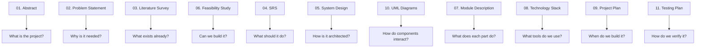

# ResearchNode — Pre-Documents Index

## Complete Project Documentation Package

**Project:** ResearchNode: A GraphRAG Reasoning Engine for Scientific Literature  
**Date:** July 2026  
**Total Documents:** 11

---

## Document List

| # | Document | File | Pages (est.) | Description |
|---|----------|------|-------------|-------------|
| 1 | **Abstract** | [01_abstract.md](file:///C:/Users/suraj/.gemini/antigravity-ide/brain/6002d056-b68a-4f77-aac7-6c48c62af177/01_abstract.md) | 1 | Project summary, keywords, and domain classification |
| 2 | **Problem Statement** | [02_problem_statement.md](file:///C:/Users/suraj/.gemini/antigravity-ide/brain/6002d056-b68a-4f77-aac7-6c48c62af177/02_problem_statement.md) | 3 | Background, problem definition, scope, expected outcomes |
| 3 | **Literature Survey** | [03_literature_survey.md](file:///C:/Users/suraj/.gemini/antigravity-ide/brain/6002d056-b68a-4f77-aac7-6c48c62af177/03_literature_survey.md) | 5 | Survey of RAG, knowledge graphs, GraphRAG, multi-agent AI, NLP |
| 4 | **System Requirements Specification** | [04_system_requirements_specification.md](file:///C:/Users/suraj/.gemini/antigravity-ide/brain/6002d056-b68a-4f77-aac7-6c48c62af177/04_system_requirements_specification.md) | 6 | 12 functional + 5 non-functional requirements, architecture |
| 5 | **System Design Document** | [05_system_design_document.md](file:///C:/Users/suraj/.gemini/antigravity-ide/brain/6002d056-b68a-4f77-aac7-6c48c62af177/05_system_design_document.md) | 7 | Architecture, DFDs, module design, database schemas, API spec |
| 6 | **Feasibility Study** | [06_feasibility_study.md](file:///C:/Users/suraj/.gemini/antigravity-ide/brain/6002d056-b68a-4f77-aac7-6c48c62af177/06_feasibility_study.md) | 4 | Technical, economic, operational, schedule, legal feasibility |
| 7 | **Module Description** | [07_module_description.md](file:///C:/Users/suraj/.gemini/antigravity-ide/brain/6002d056-b68a-4f77-aac7-6c48c62af177/07_module_description.md) | 8 | Detailed description of all 8 modules with pseudo-code |
| 8 | **Technology Stack** | [08_technology_stack.md](file:///C:/Users/suraj/.gemini/antigravity-ide/brain/6002d056-b68a-4f77-aac7-6c48c62af177/08_technology_stack.md) | 3 | All tools, libraries, databases with versions and justification |
| 9 | **Project Plan & Timeline** | [09_project_plan_timeline.md](file:///C:/Users/suraj/.gemini/antigravity-ide/brain/6002d056-b68a-4f77-aac7-6c48c62af177/09_project_plan_timeline.md) | 4 | 6-week Gantt chart, weekly tasks, milestones, risk management |
| 10 | **UML Diagrams** | [10_uml_diagrams.md](file:///C:/Users/suraj/.gemini/antigravity-ide/brain/6002d056-b68a-4f77-aac7-6c48c62af177/10_uml_diagrams.md) | 5 | Use case, class, sequence, activity, ER, component, deployment |
| 11 | **Testing Plan** | [11_testing_plan.md](file:///C:/Users/suraj/.gemini/antigravity-ide/brain/6002d056-b68a-4f77-aac7-6c48c62af177/11_testing_plan.md) | 5 | 21 test cases, test data, results template |

---

## Suggested Submission Order

For academic submission, combine documents in this order:

1. Abstract
2. Problem Statement
3. Literature Survey
4. Feasibility Study
5. System Requirements Specification
6. System Design Document
7. UML Diagrams
8. Module Description
9. Technology Stack
10. Project Plan & Timeline
11. Testing Plan

---

## What Each Document Covers

---

## Notes

> [!TIP]
> All documents are in **Markdown** format with **Mermaid diagrams**. To convert to PDF/DOCX for submission:
> - Use **VS Code** with the **Markdown PDF** extension
> - Use **Pandoc**: `pandoc file.md -o file.pdf`
> - Use **Typora** for WYSIWYG editing and export
> - Copy into **Google Docs** or **Word** and format manually

> [!IMPORTANT]
> The Mermaid diagrams will render automatically in GitHub, VS Code (with Mermaid extension), or Typora. For Word/PDF export, you may need to screenshot the rendered diagrams and paste them as images.
