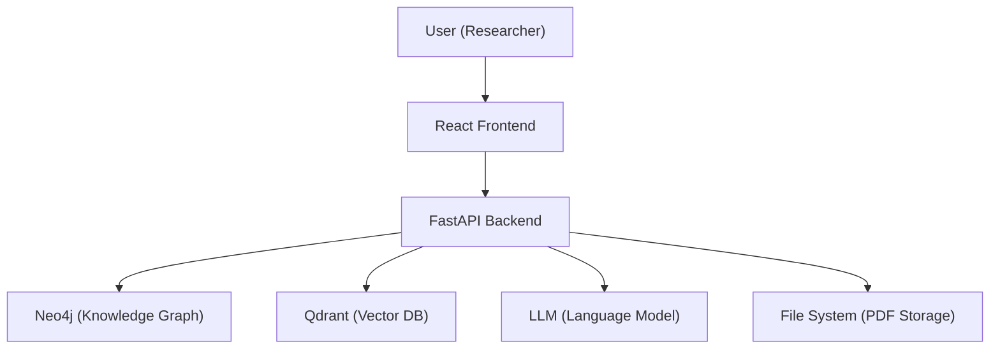
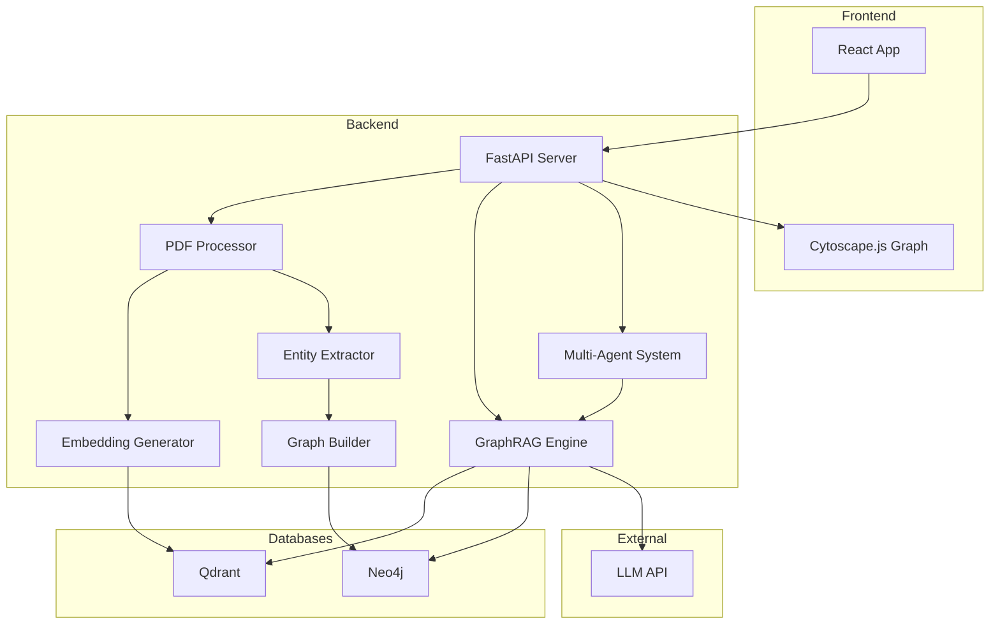

# Software Requirements Specification (SRS)

## ResearchNode: A GraphRAG Reasoning Engine for Scientific Literature

**Version:** 1.0  
**Date:** July 2026  

---

## 1. Introduction

### 1.1 Purpose
This document specifies the software requirements for **ResearchNode**, a web-based research intelligence platform that combines GraphRAG and multi-agent reasoning to analyze scientific literature. It is intended for the development team, project evaluators, and stakeholders.

### 1.2 Scope
ResearchNode is a full-stack web application that allows users to upload research papers (PDF), automatically builds a knowledge graph of scientific concepts and relationships, stores semantic embeddings for similarity search, and provides an AI-powered question-answering interface with citation-backed responses and research insight discovery.

### 1.3 Definitions and Acronyms

| Term | Definition |
|------|-----------|
| RAG | Retrieval-Augmented Generation |
| GraphRAG | Graph-enhanced Retrieval-Augmented Generation |
| KG | Knowledge Graph |
| NER | Named Entity Recognition |
| NLP | Natural Language Processing |
| LLM | Large Language Model |
| API | Application Programming Interface |
| CRUD | Create, Read, Update, Delete |
| ANN | Approximate Nearest Neighbor |
| PDF | Portable Document Format |

### 1.4 References
- IEEE Std 830-1998: IEEE Recommended Practice for Software Requirements Specifications
- Project Abstract and Problem Statement documents
- Literature Survey document

---

## 2. Overall Description

### 2.1 Product Perspective

ResearchNode is a standalone web application with the following context:

### 2.2 Product Functions (High-Level)

| # | Function | Description |
|---|----------|-------------|
| F1 | Paper Upload | Upload PDF research papers to the system |
| F2 | Text Extraction | Extract and clean text from uploaded PDFs |
| F3 | Text Chunking | Split extracted text into manageable chunks |
| F4 | Embedding Generation | Generate vector embeddings for text chunks |
| F5 | Vector Storage | Store and retrieve embeddings from Qdrant |
| F6 | Entity Extraction | Extract scientific entities (models, datasets, methods, tasks) |
| F7 | Knowledge Graph Construction | Build and update Neo4j graph with extracted entities and relationships |
| F8 | RAG Question Answering | Answer user questions using combined graph + vector retrieval |
| F9 | Multi-Agent Analysis | Run specialized agents for literature discovery, contradiction detection, and experiment suggestion |
| F10 | Graph Visualization | Display interactive knowledge graph in the browser |
| F11 | Research Gap Detection | Identify missing relationships in the knowledge graph |

### 2.3 User Characteristics

| User Type | Description | Technical Level |
|-----------|-------------|----------------|
| Researcher | Academic researcher conducting literature review | Moderate |
| Student | Graduate/undergraduate student exploring a research area | Basic to Moderate |
| Evaluator | Project evaluator assessing the system | Basic |

### 2.4 Constraints

- The system is designed as a single-user application (no authentication required for MVP)
- PDF text extraction quality depends on the PDF format (text-based PDFs only; scanned PDFs not supported in MVP)
- LLM API costs may limit the number of queries in a free-tier deployment
- Neo4j Community Edition limitations (single database)
- Internet connectivity required for LLM API calls

### 2.5 Assumptions and Dependencies

- Python 3.12 is installed on the development machine
- Node.js 18+ is installed for the React frontend
- Neo4j Desktop or Neo4j Community Server is installed and running
- Qdrant is running locally (Docker or standalone)
- An LLM API key is available (e.g., Google Gemini, OpenAI, or local Ollama)

---

## 3. Specific Requirements

### 3.1 Functional Requirements

---

#### FR-01: Paper Upload

| Attribute | Value |
|-----------|-------|
| **ID** | FR-01 |
| **Title** | Paper Upload |
| **Description** | The system shall allow users to upload research papers in PDF format through a web interface |
| **Input** | PDF file (max 50 MB) |
| **Output** | Confirmation message with paper ID and metadata |
| **Priority** | High (MVP) |

**Acceptance Criteria:**
1. User can select and upload a PDF file via the web interface
2. System validates the file is a valid PDF
3. System stores the PDF in the local file system under `papers/` directory
4. System returns a unique paper ID and extracted metadata (title, page count)

---

#### FR-02: Text Extraction

| Attribute | Value |
|-----------|-------|
| **ID** | FR-02 |
| **Title** | Text Extraction from PDF |
| **Description** | The system shall extract raw text content from uploaded PDF files using PyMuPDF |
| **Input** | PDF file path |
| **Output** | Extracted text string |
| **Priority** | High (MVP) |

**Acceptance Criteria:**
1. Text is extracted from all pages of the PDF
2. Extraction handles multi-column layouts reasonably
3. Non-text content (images, tables) is skipped gracefully
4. Extracted text is cleaned of excessive whitespace and formatting artifacts

---

#### FR-03: Text Chunking

| Attribute | Value |
|-----------|-------|
| **ID** | FR-03 |
| **Title** | Text Chunking |
| **Description** | The system shall split extracted text into overlapping chunks suitable for embedding and retrieval |
| **Input** | Raw text string |
| **Output** | List of text chunks with metadata |
| **Priority** | High (MVP) |

**Parameters:**
- Chunk size: 1000 characters
- Chunk overlap: 200 characters
- Splitter: LangChain `RecursiveCharacterTextSplitter`

---

#### FR-04: Embedding Generation

| Attribute | Value |
|-----------|-------|
| **ID** | FR-04 |
| **Title** | Embedding Generation |
| **Description** | The system shall generate dense vector embeddings for each text chunk using a sentence transformer model |
| **Input** | Text chunk |
| **Output** | 384-dimensional float vector |
| **Priority** | High (MVP) |

**Model:** `all-MiniLM-L6-v2` (Sentence Transformers)

---

#### FR-05: Vector Storage and Search

| Attribute | Value |
|-----------|-------|
| **ID** | FR-05 |
| **Title** | Vector Storage and Similarity Search |
| **Description** | The system shall store embeddings in Qdrant and retrieve the most similar chunks given a query embedding |
| **Input** | Query embedding vector |
| **Output** | Top-k similar chunks with scores and metadata |
| **Priority** | High (MVP) |

---

#### FR-06: Entity Extraction

| Attribute | Value |
|-----------|-------|
| **ID** | FR-06 |
| **Title** | Scientific Entity Extraction |
| **Description** | The system shall extract scientific entities from paper text, including models, methods, datasets, tasks, and authors |
| **Input** | Paper text |
| **Output** | List of entities with types and attributes |
| **Priority** | High (MVP) |

**Entity Types:**
- `Paper` — title, authors, year, abstract
- `Model` — model/architecture name
- `Method` — technique or approach
- `Dataset` — dataset name
- `Task` — NLP/ML task
- `Author` — author name, affiliation

---

#### FR-07: Knowledge Graph Construction

| Attribute | Value |
|-----------|-------|
| **ID** | FR-07 |
| **Title** | Knowledge Graph Construction |
| **Description** | The system shall create nodes and relationships in Neo4j based on extracted entities |
| **Input** | Extracted entities and relationships |
| **Output** | Updated Neo4j graph |
| **Priority** | High (MVP) |

**Relationship Types:**
- `USES` — Paper uses a Model/Method
- `APPLIED_TO` — Method applied to a Task
- `EVALUATED_ON` — Model evaluated on a Dataset
- `CITES` — Paper cites another Paper
- `AUTHORED_BY` — Paper authored by an Author
- `COMPARED_WITH` — Model compared with another Model

---

#### FR-08: RAG Question Answering

| Attribute | Value |
|-----------|-------|
| **ID** | FR-08 |
| **Title** | GraphRAG Question Answering |
| **Description** | The system shall answer user questions by combining vector-retrieved chunks with graph-traversed context and generating a response via LLM |
| **Input** | Natural language question |
| **Output** | Answer with citations and graph context |
| **Priority** | High (MVP) |

---

#### FR-09: Literature Discovery Agent

| Attribute | Value |
|-----------|-------|
| **ID** | FR-09 |
| **Title** | Literature Discovery Agent |
| **Description** | An AI agent that finds related papers and connections given a research topic |
| **Input** | Research topic or keyword |
| **Output** | List of related papers with relationship explanations |
| **Priority** | Medium |

---

#### FR-10: Contradiction Detection Agent

| Attribute | Value |
|-----------|-------|
| **ID** | FR-10 |
| **Title** | Contradiction Detection Agent |
| **Description** | An AI agent that identifies conflicting findings across papers in the knowledge graph |
| **Input** | Knowledge graph state |
| **Output** | List of detected contradictions with evidence |
| **Priority** | Medium |

---

#### FR-11: Experiment Suggestion Agent

| Attribute | Value |
|-----------|-------|
| **ID** | FR-11 |
| **Title** | Experiment Suggestion Agent |
| **Description** | An AI agent that suggests novel experimental directions based on gaps in the knowledge graph |
| **Input** | Knowledge graph state |
| **Output** | List of suggested experiments with rationale |
| **Priority** | Medium |

---

#### FR-12: Knowledge Graph Visualization

| Attribute | Value |
|-----------|-------|
| **ID** | FR-12 |
| **Title** | Interactive Knowledge Graph Visualization |
| **Description** | The system shall display the knowledge graph as an interactive, zoomable, clickable visualization using Cytoscape.js |
| **Input** | Graph data (nodes and edges) from Neo4j |
| **Output** | Interactive graph rendered in the browser |
| **Priority** | High (MVP) |

---

### 3.2 Non-Functional Requirements

#### NFR-01: Performance

| Attribute | Requirement |
|-----------|------------|
| PDF Processing | Extract text from a 20-page PDF in < 5 seconds |
| Embedding Generation | Generate embeddings for 50 chunks in < 10 seconds |
| Vector Search | Return top-10 results in < 500 ms |
| Graph Query | Execute Cypher query and return results in < 2 seconds |
| RAG Response | Generate a complete answer in < 15 seconds |

#### NFR-02: Usability

| Attribute | Requirement |
|-----------|------------|
| Learning Curve | A new user should be able to upload a paper and ask a question within 2 minutes |
| Error Messages | All errors should display user-friendly messages with suggested actions |
| Responsiveness | The UI should be responsive on screens 1024px and wider |

#### NFR-03: Reliability

| Attribute | Requirement |
|-----------|------------|
| Uptime | System should function reliably during demonstration |
| Data Persistence | Uploaded papers and graph data should persist across server restarts |
| Error Handling | System should handle invalid PDFs, empty queries, and database connection failures gracefully |

#### NFR-04: Scalability

| Attribute | Requirement |
|-----------|------------|
| Papers | MVP should handle up to 50 uploaded papers |
| Graph Nodes | Knowledge graph should perform well with up to 1,000 nodes |
| Vector Collection | Qdrant should handle up to 10,000 vectors |

#### NFR-05: Security

| Attribute | Requirement |
|-----------|------------|
| File Validation | Only PDF files should be accepted for upload |
| Input Sanitization | All user inputs should be sanitized before database queries |
| API Key Protection | LLM API keys should be stored in environment variables, not in source code |

---

## 4. External Interface Requirements

### 4.1 User Interface

The web application shall consist of four main screens:

1. **Dashboard** — Overview of uploaded papers and system status
2. **Upload Page** — PDF file upload with progress indicator
3. **Chat Interface** — Natural language Q&A with citation display
4. **Graph View** — Interactive knowledge graph visualization

### 4.2 API Interface

The backend shall expose a RESTful API:

| Method | Endpoint | Description |
|--------|----------|-------------|
| `POST` | `/api/upload-paper` | Upload a PDF paper |
| `POST` | `/api/query` | Ask a question |
| `GET` | `/api/graph/{paper_id}` | Get graph data for a paper |
| `GET` | `/api/graph` | Get full knowledge graph data |
| `GET` | `/api/papers` | List all uploaded papers |
| `GET` | `/api/recommendations` | Get AI-generated recommendations |
| `POST` | `/api/agents/literature` | Run literature discovery agent |
| `POST` | `/api/agents/contradiction` | Run contradiction detection agent |
| `POST` | `/api/agents/experiment` | Run experiment suggestion agent |

### 4.3 Database Interfaces

- **Neo4j:** Bolt protocol on `bolt://localhost:7687`
- **Qdrant:** REST API on `http://localhost:6333`

### 4.4 LLM Interface

- LLM API accessed via LangChain abstraction
- Supports Google Gemini, OpenAI, or local Ollama models
- Configuration via environment variables

---

## 5. System Architecture

