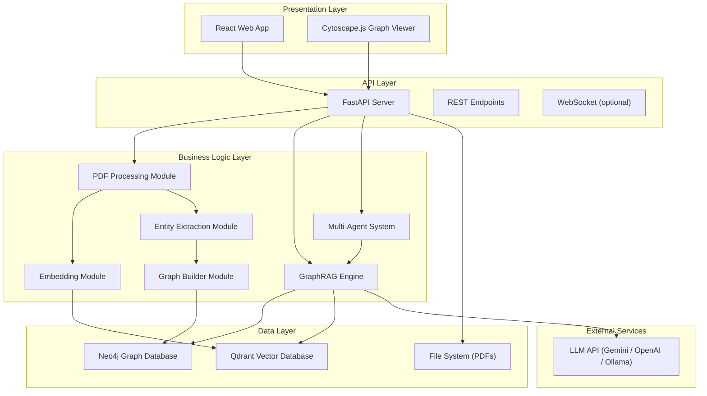
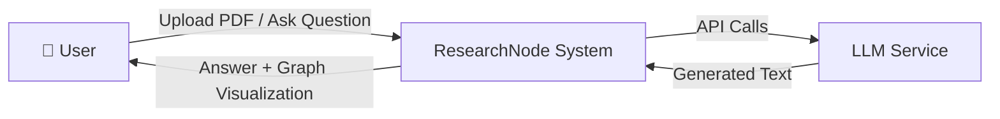
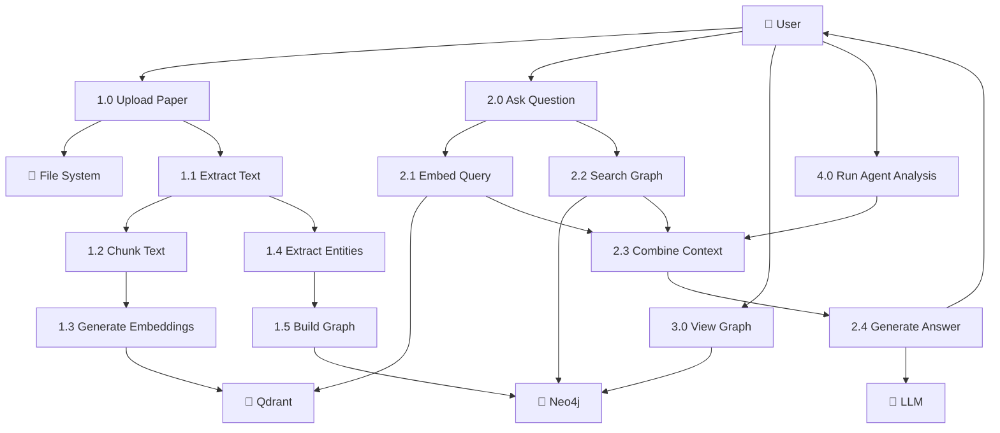
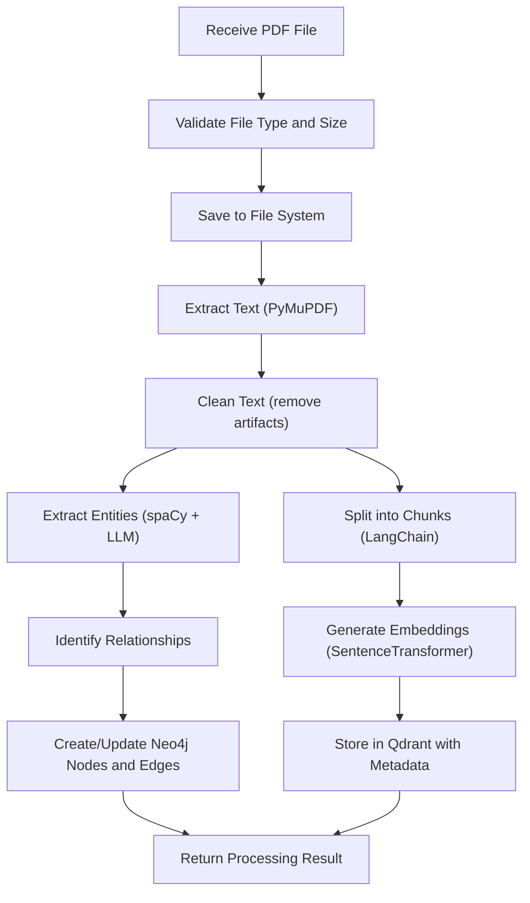
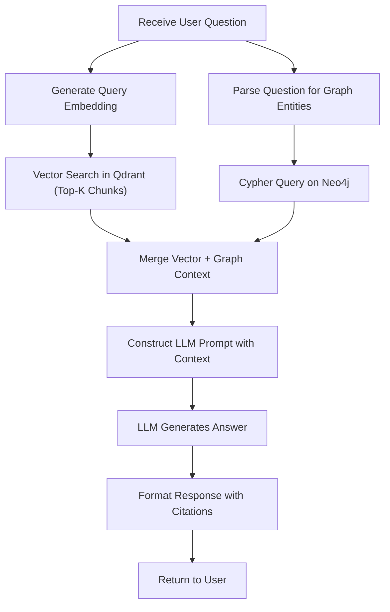
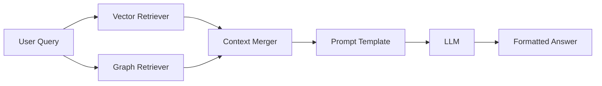
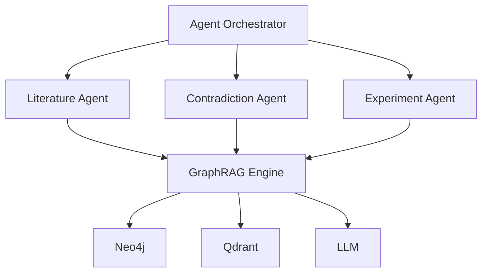
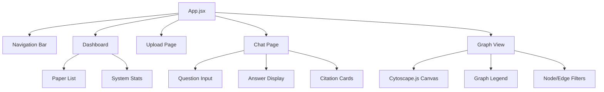
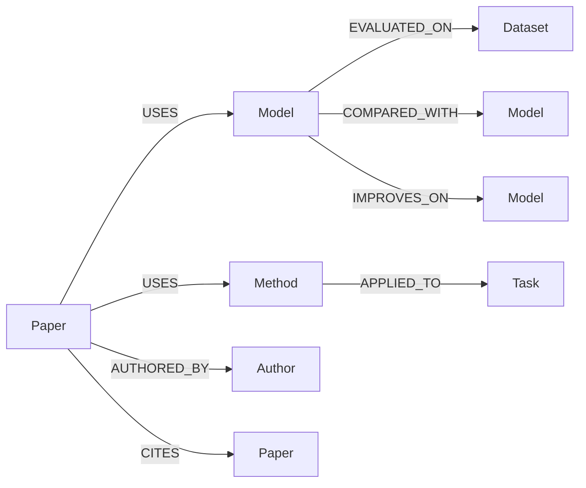

# System Design Document

## ResearchNode: A GraphRAG Reasoning Engine for Scientific Literature

**Version:** 1.0  
**Date:** July 2026

---

## 1. Introduction

This document describes the architectural design of ResearchNode, covering the system's high-level architecture, data flow, module design, database schemas, API design, and component interactions. It serves as the blueprint for implementation.

---

## 2. High-Level Architecture



### Architectural Pattern

ResearchNode follows a **layered architecture** with clear separation of concerns:

| Layer | Components | Responsibility |
|-------|-----------|---------------|
| Presentation | React, Cytoscape.js | User interface, graph visualization |
| API | FastAPI, REST endpoints | Request routing, validation, response formatting |
| Business Logic | PDF processor, embedder, graph builder, RAG engine, agents | Core application logic |
| Data | Neo4j, Qdrant, file system | Persistent storage and retrieval |
| External | LLM API | Natural language generation |

---

## 3. Data Flow Diagrams

### 3.1 Level 0 — Context Diagram



### 3.2 Level 1 — System DFD



### 3.3 Level 2 — Paper Upload Process



### 3.4 Level 2 — Query Processing



---

## 4. Module Design

### 4.1 PDF Processing Module

```
backend/pdf_processing/
├── extractor.py    — PDF text extraction using PyMuPDF
└── cleaner.py      — Text cleaning and normalization
```

| Component | Input | Output | Library |
|-----------|-------|--------|---------|
| `extract_pdf()` | PDF file path | Raw text string | PyMuPDF (fitz) |
| `clean_text()` | Raw text | Cleaned text | regex, string |
| `split_into_sections()` | Cleaned text | Dict of sections | regex |

**Cleaning Operations:**
- Remove excessive whitespace and newlines
- Fix hyphenated words at line breaks
- Remove page numbers and headers/footers
- Normalize Unicode characters

---

### 4.2 Embedding Module

```
backend/embeddings/
└── embedder.py     — Text-to-vector embedding generation
```

| Component | Input | Output | Library |
|-----------|-------|--------|---------|
| `EmbeddingService.__init__()` | Model name | Loaded model | sentence-transformers |
| `embed_text()` | Single text string | 384-dim vector | sentence-transformers |
| `embed_batch()` | List of text strings | List of vectors | sentence-transformers |
| `store_embeddings()` | Vectors + metadata | Qdrant point IDs | qdrant-client |
| `search_similar()` | Query vector, top_k | Similar chunks + scores | qdrant-client |

---

### 4.3 Entity Extraction Module

```
backend/graph/
└── graph_builder.py — Entity and relationship extraction
```

**Entity Types and Extraction Strategy:**

| Entity Type | Extraction Method | Example |
|-------------|------------------|---------|
| Paper | Metadata parsing | "Attention Is All You Need" |
| Model | NER + pattern matching | BERT, GPT, ResNet |
| Method | LLM-assisted extraction | Self-attention, backpropagation |
| Dataset | NER + keyword detection | ImageNet, GLUE, SQuAD |
| Task | LLM-assisted extraction | Sentiment analysis, object detection |
| Author | Metadata parsing | Vaswani et al. |

**Relationship Types:**

| Relationship | From | To | Description |
|-------------|------|----|-------------|
| `USES` | Paper | Model/Method | Paper uses a model or method |
| `EVALUATED_ON` | Model | Dataset | Model is tested on a dataset |
| `APPLIED_TO` | Method | Task | Method is used for a task |
| `CITES` | Paper | Paper | Citation relationship |
| `AUTHORED_BY` | Paper | Author | Authorship |
| `COMPARED_WITH` | Model | Model | Comparative study |
| `IMPROVES_ON` | Model | Model | One model improves another |

---

### 4.4 Knowledge Graph Module

```
backend/graph/
└── neo4j.py        — Neo4j database operations
```

| Component | Input | Output |
|-----------|-------|--------|
| `Neo4jService.__init__()` | URI, credentials | Connected driver |
| `create_paper_node()` | Paper metadata | Node ID |
| `create_entity_node()` | Entity type + attributes | Node ID |
| `create_relationship()` | Source, target, rel_type | Relationship ID |
| `query_graph()` | Cypher query string | Query results |
| `get_paper_subgraph()` | Paper ID | Nodes + edges JSON |
| `get_full_graph()` | — | Complete graph JSON |
| `find_missing_edges()` | — | Potential research gaps |

**Neo4j Schema:**

```cypher
// Node constraints
CREATE CONSTRAINT paper_name IF NOT EXISTS
  FOR (p:Paper) REQUIRE p.name IS UNIQUE;

CREATE CONSTRAINT model_name IF NOT EXISTS
  FOR (m:Model) REQUIRE m.name IS UNIQUE;

CREATE CONSTRAINT dataset_name IF NOT EXISTS
  FOR (d:Dataset) REQUIRE d.name IS UNIQUE;

CREATE CONSTRAINT method_name IF NOT EXISTS
  FOR (mt:Method) REQUIRE mt.name IS UNIQUE;

CREATE CONSTRAINT task_name IF NOT EXISTS
  FOR (t:Task) REQUIRE t.name IS UNIQUE;

CREATE CONSTRAINT author_name IF NOT EXISTS
  FOR (a:Author) REQUIRE a.name IS UNIQUE;
```

---

### 4.5 GraphRAG Engine

```
backend/rag/
├── retriever.py    — Hybrid retrieval (vector + graph)
└── generator.py    — LLM-based answer generation
```

**Retrieval Pipeline:**



| Component | Description |
|-----------|-------------|
| `VectorRetriever` | Embeds query, searches Qdrant, returns top-k chunks |
| `GraphRetriever` | Extracts entities from query, runs Cypher, returns graph context |
| `ContextMerger` | Combines vector chunks + graph paths into a single context string |
| `PromptTemplate` | Structures context + question into LLM prompt |
| `AnswerGenerator` | Calls LLM, parses response, adds citations |

---

### 4.6 Multi-Agent System

```
backend/agents/
├── literature.py      — Literature Discovery Agent
├── contradiction.py   — Contradiction Detection Agent
└── experiment.py      — Experiment Suggestion Agent
```

**Agent Architecture:**



| Agent | Input | Processing | Output |
|-------|-------|-----------|--------|
| Literature Agent | Research topic | Graph traversal + vector search | Related papers with relationships |
| Contradiction Agent | Knowledge graph | Compare findings across papers | List of contradictions with evidence |
| Experiment Agent | Knowledge graph | Identify missing edges/nodes | Suggested experiments with rationale |

---

### 4.7 API Layer

```
backend/api/
├── upload.py    — Paper upload endpoints
└── query.py     — Query and agent endpoints
```

**API Design:**

| Endpoint | Method | Request Body | Response |
|----------|--------|-------------|----------|
| `/api/upload-paper` | POST | `multipart/form-data` (file) | `{paper_id, title, status}` |
| `/api/papers` | GET | — | `[{paper_id, title, pages, date}]` |
| `/api/query` | POST | `{question: str}` | `{answer, citations[], graph_context}` |
| `/api/graph` | GET | — | `{nodes[], edges[]}` |
| `/api/graph/{paper_id}` | GET | — | `{nodes[], edges[]}` |
| `/api/agents/literature` | POST | `{topic: str}` | `{papers[], relationships[]}` |
| `/api/agents/contradiction` | POST | — | `{contradictions[]}` |
| `/api/agents/experiment` | POST | — | `{suggestions[]}` |
| `/api/recommendations` | GET | — | `{gaps[], trends[]}` |

---

### 4.8 Frontend

```
frontend/src/
├── components/
│   ├── Upload.jsx       — Paper upload form
│   ├── Chat.jsx         — Question-answer interface
│   ├── Graph.jsx        — Knowledge graph visualization
│   └── Dashboard.jsx    — Overview and navigation
├── App.jsx
└── index.js
```

**Component Hierarchy:**



---

## 5. Database Design

### 5.1 Neo4j Graph Schema



**Node Properties:**

| Node Type | Properties |
|-----------|-----------|
| Paper | `name`, `title`, `year`, `abstract`, `source_file`, `upload_date` |
| Model | `name`, `type`, `parameters`, `year_introduced` |
| Method | `name`, `category`, `description` |
| Dataset | `name`, `domain`, `size`, `task_type` |
| Task | `name`, `domain`, `description` |
| Author | `name`, `affiliation`, `email` |

### 5.2 Qdrant Vector Schema

**Collection:** `research_chunks`

| Field | Type | Description |
|-------|------|-------------|
| `id` | UUID | Unique chunk identifier |
| `vector` | float[384] | Embedding from all-MiniLM-L6-v2 |
| `payload.paper_id` | string | Reference to source paper |
| `payload.paper_title` | string | Paper title |
| `payload.chunk_index` | integer | Position in the paper |
| `payload.chunk_text` | string | Original text content |
| `payload.section` | string | Paper section (abstract, method, etc.) |

---

## 6. Technology Justification

| Technology | Choice | Justification |
|-----------|--------|---------------|
| Backend Framework | FastAPI | Async support, auto-documentation, type validation, high performance |
| Frontend Framework | React | Component-based, large ecosystem, excellent for SPAs |
| Graph Database | Neo4j | Industry standard for graph data, Cypher query language, Python driver |
| Vector Database | Qdrant | Rust-based (fast), simple API, metadata filtering, open-source |
| Embedding Model | all-MiniLM-L6-v2 | Good quality/speed tradeoff, 384 dims (memory efficient), free |
| PDF Extraction | PyMuPDF | Fast, reliable, handles most PDF formats, pure Python |
| NLP | spaCy | Pre-trained NER models, fast, production-ready |
| LLM Orchestration | LangChain | Abstracts LLM providers, text splitters, prompt templates, chain composition |
| Graph Visualization | Cytoscape.js | Mature, performant, extensive styling options, academic origin |
| Language | Python 3.12 | ML/AI ecosystem, Neo4j/Qdrant drivers, FastAPI support |
