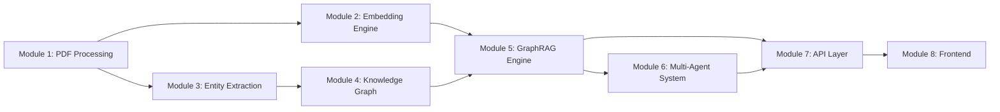
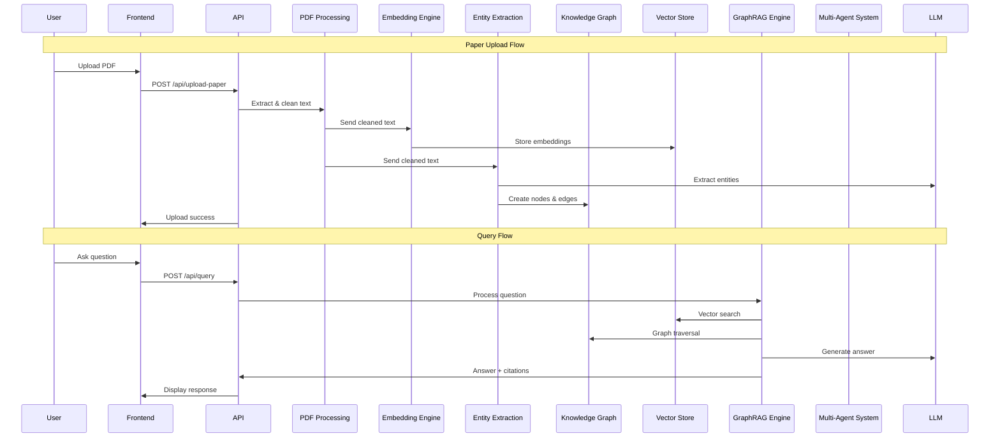

# Module Description

## ResearchNode: A GraphRAG Reasoning Engine for Scientific Literature

**Version:** 1.0  
**Date:** July 2026

---

## 1. Module Overview

ResearchNode consists of **8 modules** organized in a pipeline architecture:



---

## 2. Module 1 — PDF Processing

### Purpose
Extract and prepare text from uploaded PDF research papers for downstream processing.

### Location
```
backend/pdf_processing/
├── extractor.py
└── cleaner.py
```

### Sub-components

#### 2.1 PDF Extractor (`extractor.py`)

**Input:** PDF file path (`str`)  
**Output:** Raw text content (`str`)

```python
# Pseudo-code
class PDFExtractor:

    def extract(self, file_path: str) -> str:
        """
        Opens PDF using PyMuPDF (fitz).
        Iterates through all pages.
        Concatenates text from each page.
        Returns complete raw text.
        """

    def extract_metadata(self, file_path: str) -> dict:
        """
        Extracts PDF metadata:
        - title, author, subject, page_count
        - creation_date, modification_date
        Returns metadata dictionary.
        """
```

#### 2.2 Text Cleaner (`cleaner.py`)

**Input:** Raw extracted text (`str`)  
**Output:** Cleaned, normalized text (`str`)

```python
# Pseudo-code
class TextCleaner:

    def clean(self, raw_text: str) -> str:
        """
        Operations:
        1. Remove excessive whitespace and blank lines
        2. Fix hyphenated words at line breaks (e.g., "trans-\nformer" → "transformer")
        3. Remove page numbers and running headers/footers
        4. Normalize Unicode characters
        5. Remove reference section markers
        Returns cleaned text.
        """

    def split_sections(self, text: str) -> dict:
        """
        Attempts to identify paper sections:
        Abstract, Introduction, Related Work,
        Methodology, Results, Conclusion, References.
        Returns dict mapping section names to content.
        """
```

### Dependencies
- `PyMuPDF (fitz)` — PDF reading
- `re` — Regular expressions for cleaning

---

## 3. Module 2 — Embedding Engine

### Purpose
Convert text chunks into dense vector embeddings and manage vector storage/retrieval in Qdrant.

### Location
```
backend/embeddings/
└── embedder.py
```

### Sub-components

#### 3.1 Chunker

**Input:** Cleaned text (`str`)  
**Output:** List of text chunks (`list[str]`)

```python
# Pseudo-code
class TextChunker:

    def __init__(self, chunk_size=1000, chunk_overlap=200):
        """
        Initializes LangChain RecursiveCharacterTextSplitter
        with specified chunk_size and chunk_overlap.
        """

    def chunk(self, text: str) -> list[str]:
        """
        Splits text into overlapping chunks.
        Each chunk is approximately chunk_size characters.
        Overlap ensures context is preserved across boundaries.
        Returns list of chunk strings.
        """
```

#### 3.2 Embedding Generator

**Input:** Text string or list of strings  
**Output:** NumPy array of shape `(n, 384)`

```python
# Pseudo-code
class EmbeddingGenerator:

    def __init__(self, model_name="all-MiniLM-L6-v2"):
        """
        Loads the SentenceTransformer model.
        Model is cached after first load.
        """

    def embed(self, text: str) -> np.ndarray:
        """
        Generates a 384-dimensional embedding
        for a single text string.
        """

    def embed_batch(self, texts: list[str]) -> np.ndarray:
        """
        Generates embeddings for multiple texts
        in a single batch for efficiency.
        """
```

#### 3.3 Vector Store Manager

**Input:** Embeddings + metadata  
**Output:** Qdrant point IDs / search results

```python
# Pseudo-code
class VectorStoreManager:

    def __init__(self, host="localhost", port=6333, collection="research_chunks"):
        """
        Connects to Qdrant server.
        Creates collection if it doesn't exist.
        Collection uses Cosine distance, 384 dimensions.
        """

    def store(self, embeddings, metadata_list) -> list[str]:
        """
        Upserts embedding vectors with associated metadata
        (paper_id, paper_title, chunk_index, chunk_text, section).
        Returns list of generated point IDs.
        """

    def search(self, query_vector, top_k=5) -> list[dict]:
        """
        Finds the top_k most similar vectors in the collection.
        Returns list of {score, chunk_text, paper_title, section}.
        """
```

### Dependencies
- `sentence-transformers` — Embedding model
- `qdrant-client` — Vector database client
- `langchain` — Text splitter

---

## 4. Module 3 — Entity Extraction

### Purpose
Extract scientific entities (models, methods, datasets, tasks, authors) from paper text using a hybrid NLP + LLM approach.

### Location
```
backend/graph/
└── graph_builder.py  (entity extraction portion)
```

### Sub-components

#### 4.1 NER-Based Extractor

```python
# Pseudo-code
class NERExtractor:

    def __init__(self):
        """
        Loads spaCy model (en_core_web_sm).
        Defines custom entity patterns for scientific terms.
        """

    def extract_entities(self, text: str) -> list[dict]:
        """
        Runs spaCy NER pipeline on text.
        Extracts: PERSON (authors), ORG (institutions),
        PRODUCT (models/tools), and custom patterns.
        Returns list of {text, label, start, end}.
        """
```

#### 4.2 LLM-Based Extractor

```python
# Pseudo-code
class LLMEntityExtractor:

    def extract_structured(self, text: str) -> dict:
        """
        Sends text to LLM with a structured prompt:

        "From the following research paper text,
         extract the following entities:
         - Models/Architectures used
         - Methods/Techniques described
         - Datasets mentioned
         - Tasks/Applications addressed
         - Key findings/results

         Return as JSON."

        Parses LLM response into structured entities.
        """
```

#### 4.3 Relationship Identifier

```python
# Pseudo-code
class RelationshipIdentifier:

    def identify(self, entities: list[dict], text: str) -> list[dict]:
        """
        Given extracted entities, identifies relationships:
        - Paper USES Model/Method
        - Model EVALUATED_ON Dataset
        - Method APPLIED_TO Task
        - Model COMPARED_WITH Model
        - Model IMPROVES_ON Model

        Uses both rule-based patterns and LLM-assisted extraction.
        Returns list of {source, target, relationship_type}.
        """
```

### Dependencies
- `spacy` — Named Entity Recognition
- LLM API — Structured entity extraction

---

## 5. Module 4 — Knowledge Graph

### Purpose
Manage the Neo4j knowledge graph — create nodes, relationships, and execute queries.

### Location
```
backend/graph/
└── neo4j.py
```

### Sub-components

```python
# Pseudo-code
class Neo4jService:

    def __init__(self, uri, username, password):
        """
        Establishes connection to Neo4j using Bolt protocol.
        Verifies connectivity.
        Creates uniqueness constraints if they don't exist.
        """

    def create_paper_node(self, paper_data: dict) -> str:
        """
        Creates a Paper node with properties:
        name, title, year, abstract, source_file, upload_date.
        Uses MERGE to avoid duplicates.
        """

    def create_entity_node(self, entity_type: str, properties: dict) -> str:
        """
        Creates a node of the specified type
        (Model, Method, Dataset, Task, Author).
        Uses MERGE to avoid duplicates.
        """

    def create_relationship(self, source_type, source_name,
                            target_type, target_name,
                            rel_type, properties=None) -> None:
        """
        Creates a relationship between two existing nodes.
        Example: (Paper)-[:USES]->(Model)
        """

    def get_paper_subgraph(self, paper_id: str) -> dict:
        """
        Returns all nodes and relationships connected to a paper.
        Depth: 2 hops from the paper node.
        Returns {nodes: [...], edges: [...]}.
        """

    def get_full_graph(self) -> dict:
        """
        Returns the entire knowledge graph.
        Format suitable for Cytoscape.js rendering.
        """

    def query(self, cypher: str, params: dict = None) -> list:
        """
        Executes a raw Cypher query.
        Returns list of records.
        """

    def find_research_gaps(self) -> list:
        """
        Identifies potential research gaps by finding:
        - Models not yet applied to certain Tasks
        - Methods not yet evaluated on certain Datasets
        - Tasks with few associated methods
        Returns list of gap descriptions.
        """

    def close(self):
        """Closes the Neo4j driver connection."""
```

### Dependencies
- `neo4j` — Official Python driver

---

## 6. Module 5 — GraphRAG Engine

### Purpose
The core intelligence module that combines vector retrieval, graph context, and LLM generation to answer user questions with citation-backed responses.

### Location
```
backend/rag/
├── retriever.py
└── generator.py
```

### Sub-components

#### 6.1 Hybrid Retriever (`retriever.py`)

```python
# Pseudo-code
class HybridRetriever:

    def __init__(self, vector_store, neo4j_service):
        """
        Initializes with references to both Qdrant and Neo4j services.
        """

    def retrieve(self, query: str, top_k: int = 5) -> dict:
        """
        Pipeline:
        1. Embed the query using EmbeddingGenerator
        2. Search Qdrant for top_k similar chunks
        3. Extract key terms from query
        4. Run Cypher queries on Neo4j for related graph paths
        5. Combine vector results + graph results into context

        Returns {
            vector_chunks: [...],
            graph_context: [...],
            combined_context: str
        }
        """
```

#### 6.2 Answer Generator (`generator.py`)

```python
# Pseudo-code
class AnswerGenerator:

    def __init__(self, llm_client):
        """
        Initializes with LLM client (via LangChain).
        Loads prompt templates.
        """

    def generate(self, question: str, context: dict) -> dict:
        """
        Constructs a prompt:

        "You are a research assistant. Based on the following context
         from research papers, answer the question.

         Vector Search Context:
         {context.vector_chunks}

         Knowledge Graph Context:
         {context.graph_context}

         Question: {question}

         Provide a detailed answer with citations to specific papers."

        Calls LLM, parses response.

        Returns {
            answer: str,
            citations: [{paper_title, relevant_quote}],
            confidence: float
        }
        """
```

### Dependencies
- Module 2 (Embedding Engine)
- Module 4 (Knowledge Graph)
- `langchain` — LLM orchestration

---

## 7. Module 6 — Multi-Agent System

### Purpose
Three specialized AI agents that analyze the knowledge graph to provide advanced research insights.

### Location
```
backend/agents/
├── literature.py
├── contradiction.py
└── experiment.py
```

### Sub-components

#### 7.1 Literature Discovery Agent (`literature.py`)

```python
# Pseudo-code
class LiteratureAgent:

    def run(self, topic: str) -> dict:
        """
        Input: Research topic (e.g., "CNN for medical imaging")

        Process:
        1. Search Qdrant for papers related to the topic
        2. Traverse Neo4j to find connected papers via shared
           methods, datasets, or tasks
        3. Rank papers by relevance (vector similarity + graph centrality)
        4. Use LLM to summarize how papers relate to each other

        Output: {
            related_papers: [{title, relevance_score, connection_type}],
            relationship_summary: str,
            suggested_reading_order: [str]
        }
        """
```

#### 7.2 Contradiction Detection Agent (`contradiction.py`)

```python
# Pseudo-code
class ContradictionAgent:

    def run(self) -> dict:
        """
        Input: Current knowledge graph state

        Process:
        1. Find pairs of papers that study the same topic/task
        2. Extract their findings/conclusions from stored chunks
        3. Use LLM to compare findings and identify contradictions
        4. Score contradiction severity

        Output: {
            contradictions: [{
                paper_a: str,
                paper_b: str,
                claim_a: str,
                claim_b: str,
                explanation: str,
                severity: "high" | "medium" | "low"
            }]
        }
        """
```

#### 7.3 Experiment Suggestion Agent (`experiment.py`)

```python
# Pseudo-code
class ExperimentAgent:

    def run(self) -> dict:
        """
        Input: Current knowledge graph state

        Process:
        1. Analyze graph structure for missing edges
           (e.g., Model X never evaluated on Dataset Y)
        2. Identify under-explored combinations
        3. Use LLM to generate feasible experiment proposals
        4. Rank by novelty and feasibility

        Output: {
            suggestions: [{
                experiment: str,
                rationale: str,
                required_resources: [str],
                novelty_score: float,
                based_on: [str]  # papers that inspired this
            }]
        }
        """
```

### Dependencies
- Module 5 (GraphRAG Engine)
- Module 4 (Knowledge Graph)
- LLM API

---

## 8. Module 7 — API Layer

### Purpose
Expose all backend functionality as RESTful API endpoints using FastAPI.

### Location
```
backend/
├── main.py          — FastAPI app initialization, CORS, startup/shutdown
├── config.py        — Configuration and environment variables
└── api/
    ├── upload.py    — Paper upload endpoints
    └── query.py     — Query and agent endpoints
```

### Sub-components

#### 8.1 Application Setup (`main.py`)

```python
# Pseudo-code
app = FastAPI(title="ResearchNode API")

# CORS middleware for React frontend
# Startup event: initialize Neo4j, Qdrant, Embedding model
# Shutdown event: close connections

# Include routers from api/upload.py and api/query.py
```

#### 8.2 Upload Router (`api/upload.py`)

| Endpoint | Method | Description |
|----------|--------|-------------|
| `/api/upload-paper` | POST | Accept PDF, process, build graph, store embeddings |
| `/api/papers` | GET | List all uploaded papers with metadata |
| `/api/papers/{id}` | GET | Get details of a specific paper |
| `/api/papers/{id}` | DELETE | Remove a paper and its graph/vector data |

#### 8.3 Query Router (`api/query.py`)

| Endpoint | Method | Description |
|----------|--------|-------------|
| `/api/query` | POST | Ask a question, get GraphRAG answer |
| `/api/graph` | GET | Get full knowledge graph for visualization |
| `/api/graph/{paper_id}` | GET | Get subgraph for a specific paper |
| `/api/agents/literature` | POST | Run literature discovery agent |
| `/api/agents/contradiction` | POST | Run contradiction detection |
| `/api/agents/experiment` | POST | Run experiment suggestion |
| `/api/recommendations` | GET | Get AI-generated research recommendations |

### Dependencies
- `fastapi` — Web framework
- `uvicorn` — ASGI server
- All business logic modules (2–6)

---

## 9. Module 8 — Frontend

### Purpose
Provide a modern, intuitive web interface for interacting with ResearchNode.

### Location
```
frontend/src/
├── App.jsx
├── index.js
├── index.css
└── components/
    ├── Dashboard.jsx
    ├── Upload.jsx
    ├── Chat.jsx
    └── Graph.jsx
```

### Sub-components

#### 9.1 Dashboard (`Dashboard.jsx`)

- Displays system overview: number of papers, graph statistics
- Quick actions: upload paper, start chat
- Recent activity feed

#### 9.2 Upload Component (`Upload.jsx`)

- Drag-and-drop PDF upload area
- File validation (PDF only, size limit)
- Upload progress bar
- Processing status indicator (extracting → chunking → embedding → graphing)
- Success/error feedback

#### 9.3 Chat Component (`Chat.jsx`)

- Chat message history (user questions + AI responses)
- Text input with send button
- Citation cards displayed alongside answers
- Loading indicator during LLM processing
- Agent results display (literature, contradictions, experiments)

#### 9.4 Graph Visualization (`Graph.jsx`)

- Interactive Cytoscape.js canvas
- Node types distinguished by color and shape:
  - Paper: 🔵 Blue circle
  - Model: 🟢 Green diamond
  - Method: 🟡 Yellow triangle
  - Dataset: 🟠 Orange square
  - Task: 🟣 Purple hexagon
  - Author: ⚪ Gray circle
- Edge labels showing relationship types
- Zoom, pan, and click-to-inspect functionality
- Filter panel to show/hide node types
- Search within graph

### Dependencies
- `react` — UI framework
- `cytoscape` — Graph visualization
- `axios` — HTTP client for API calls
- `react-router-dom` — Client-side routing

---

## 10. Module Interaction Summary


