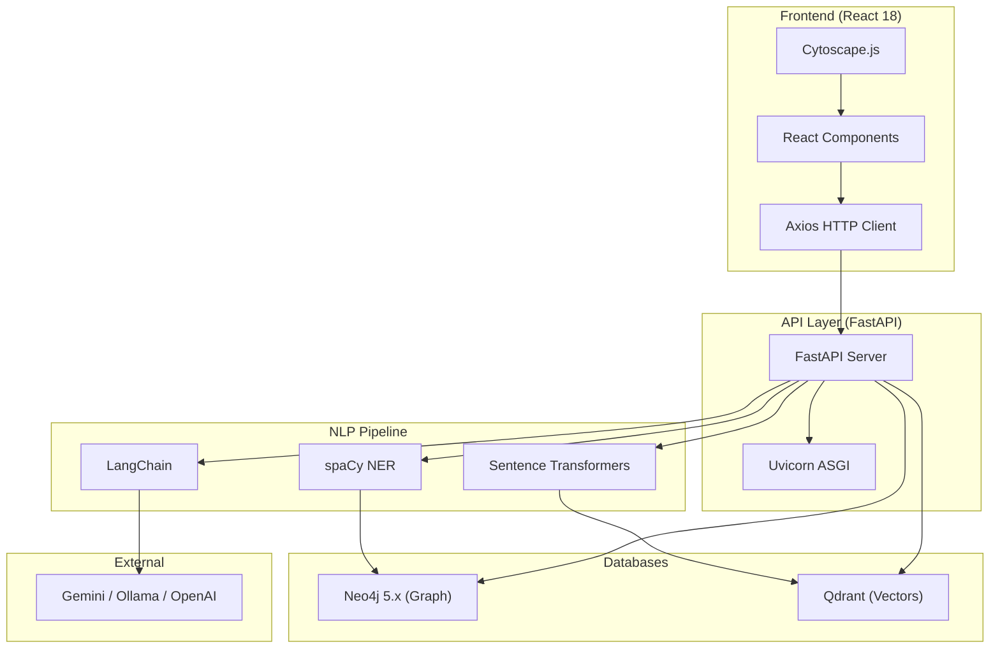

# Technology Stack

## ResearchNode: A GraphRAG Reasoning Engine for Scientific Literature

**Date:** July 2026

---

## 1. Overview

ResearchNode uses a modern, open-source technology stack spanning backend processing, AI/ML, graph and vector databases, and a reactive frontend. Every technology choice prioritizes **zero cost**, **strong community support**, and **educational value** for a college mini project.

---

## 2. Complete Technology Stack

### 2.1 Backend — Core

| Technology | Version | Purpose | License |
|-----------|---------|---------|---------|
| **Python** | 3.12 | Primary programming language | PSF |
| **FastAPI** | 0.115+ | Web framework for REST API | MIT |
| **Uvicorn** | 0.30+ | ASGI server for FastAPI | BSD |
| **Pydantic** | 2.0+ | Data validation and serialization | MIT |

### 2.2 Backend — NLP & AI

| Technology                | Version | Purpose                                             | License    |
| ------------------------- | ------- | --------------------------------------------------- | ---------- |
| **LangChain**             | 0.2+    | LLM orchestration, text splitting, prompt templates | MIT        |
| **LangChain Community**   | 0.2+    | Community integrations (Neo4j, Qdrant)              | MIT        |
| **spaCy**                 | 3.7+    | Named Entity Recognition (NER)                      | MIT        |
| **en_core_web_sm**        | 3.7+    | spaCy English NER model                             | MIT        |
| **Sentence Transformers** | 3.0+    | Text embedding generation                           | Apache 2.0 |
| **all-MiniLM-L6-v2**      | —       | Embedding model (384 dimensions)                    | Apache 2.0 |

### 2.3 Backend — LLM

| Technology                      | Purpose                                      | Cost                |
| ------------------------------- | -------------------------------------------- | ------------------- |
| **Google Gemini API** (Primary) | LLM for answer generation, entity extraction | Free tier available |
| **Ollama** (Fallback)           | Local LLM inference (Llama 3, Mistral)       | Free (local)        |
| **OpenAI API** (Alternative)    | GPT-4o for high-quality generation           | Paid                |
| **Groq API** (Alternative)      | Fast inference with open models              | Free tier available |

### 2.4 Databases

| Technology | Version | Type | Purpose | License |
|-----------|---------|------|---------|---------|
| **Neo4j Community** | 5.x | Graph Database | Knowledge graph storage, Cypher queries | GPL v3 |
| **Qdrant** | 1.10+ | Vector Database | Embedding storage, similarity search | Apache 2.0 |

### 2.5 PDF Processing

| Technology | Version | Purpose | License |
|-----------|---------|---------|---------|
| **PyMuPDF (fitz)** | 1.24+ | PDF text extraction | AGPL v3 |
| **pandas** | 2.2+ | Data manipulation and analysis | BSD |

### 2.6 Frontend

| Technology | Version | Purpose | License |
|-----------|---------|---------|---------|
| **React** | 18+ | UI component framework | MIT |
| **Cytoscape.js** | 3.28+ | Interactive graph visualization | MIT |
| **Axios** | 1.7+ | HTTP client for API communication | MIT |
| **React Router** | 6+ | Client-side routing | MIT |

### 2.7 Development Tools

| Tool | Purpose |
|------|---------|
| **VS Code** | Primary IDE |
| **Git** | Version control |
| **GitHub** | Repository hosting |
| **Docker** (optional) | Containerized Qdrant deployment |
| **Postman** | API testing |
| **Neo4j Browser** | Graph database UI |
| **npm / Node.js** | Frontend build tooling |

---

## 3. Architecture Diagram with Technologies

---

## 4. Embedding Model Specifications

| Property | Value |
|----------|-------|
| Model Name | `all-MiniLM-L6-v2` |
| Architecture | MiniLM (distilled from BERT) |
| Dimensions | 384 |
| Max Sequence Length | 256 tokens |
| Speed | ~14,000 sentences/sec on GPU |
| Size | ~80 MB |
| Training Data | 1 billion+ sentence pairs |
| Similarity Metric | Cosine similarity |

---

## 5. Database Specifications

### 5.1 Neo4j

| Property | Value |
|----------|-------|
| Edition | Community (free) |
| Protocol | Bolt (port 7687) |
| Query Language | Cypher |
| Python Driver | `neo4j` (official) |
| Max Nodes (practical) | Millions (well within our needs) |
| Visualization | Neo4j Browser (built-in) |

### 5.2 Qdrant

| Property | Value |
|----------|-------|
| Deployment | Self-hosted (Docker or binary) |
| Protocol | REST API (port 6333) / gRPC (port 6334) |
| Distance Metric | Cosine |
| Vector Dimensions | 384 |
| Payload Filtering | Yes (paper_id, section, etc.) |
| Python Client | `qdrant-client` (official) |

---

## 6. API Specification

| Property | Value |
|----------|-------|
| Framework | FastAPI |
| Protocol | HTTP/REST |
| Port | 8000 (default) |
| Documentation | Auto-generated Swagger UI at `/docs` |
| Serialization | JSON |
| Validation | Pydantic models |
| CORS | Enabled for frontend origin |

---

## 7. Why These Technologies?

| Decision | Chosen | Alternative Considered | Reason |
|----------|--------|----------------------|--------|
| Backend | FastAPI | Flask, Django | Async, auto-docs, type-safe, modern |
| Graph DB | Neo4j | ArangoDB, JanusGraph | Best Python driver, Cypher is readable, desktop app |
| Vector DB | Qdrant | ChromaDB, Pinecone, Weaviate | Fast (Rust), simple API, free self-hosted, metadata filtering |
| Embeddings | MiniLM-L6-v2 | Ada-002, BGE-large | Free, fast, 384-dim (lightweight), good quality |
| PDF | PyMuPDF | PDFMiner, GROBID | Fastest, simplest API, reliable |
| NLP | spaCy | NLTK, Stanza | Production-ready, fast, pre-trained models |
| LLM Framework | LangChain | LlamaIndex, Haystack | Broadest integrations, active community, good documentation |
| Frontend | React | Vue, Svelte, Angular | Largest ecosystem, most tutorials, best for SPAs |
| Graph Viz | Cytoscape.js | D3.js, vis.js, Sigma.js | Purpose-built for graph data, academic origin, excellent docs |
