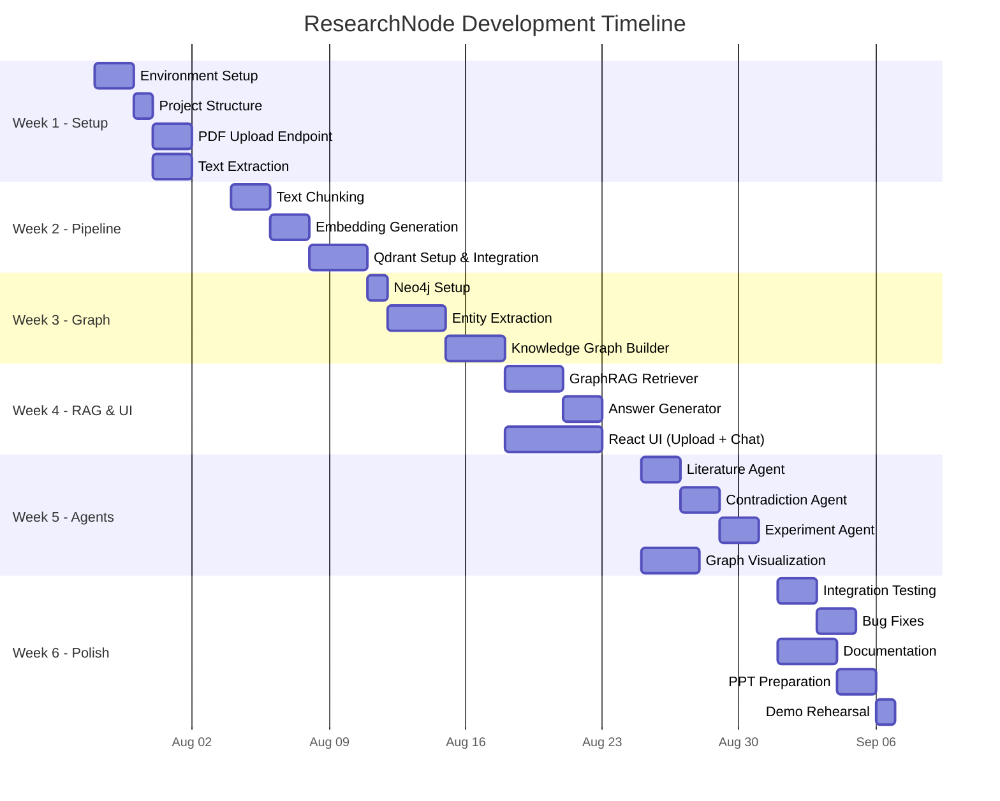

# Project Plan & Timeline

## ResearchNode: A GraphRAG Reasoning Engine for Scientific Literature

**Date:** July 2026  
**Duration:** 6 Weeks

---

## 1. Gantt Chart

---

## 2. Weekly Breakdown

### Week 1 — Foundation (July 28 – August 3)

| # | Task | Deliverable | Status |
|---|------|------------|--------|
| 1.1 | Create Python virtual environment | `researchnode-env/` | ⬜ |
| 1.2 | Install all backend dependencies | `requirements.txt` | ⬜ |
| 1.3 | Create project folder structure | All directories and `__init__.py` files | ⬜ |
| 1.4 | Setup FastAPI with basic health check | `GET /health` returns `{"status": "ok"}` | ⬜ |
| 1.5 | Implement PDF upload endpoint | `POST /api/upload-paper` accepts PDF | ⬜ |
| 1.6 | Implement text extraction | `extractor.py` extracts text from PDF | ⬜ |
| 1.7 | Implement text cleaning | `cleaner.py` normalizes extracted text | ⬜ |

**Milestone:** User can upload a PDF and the system extracts clean text.

---

### Week 2 — Embedding Pipeline (August 4 – August 10)

| # | Task | Deliverable | Status |
|---|------|------------|--------|
| 2.1 | Implement text chunking | `RecursiveCharacterTextSplitter` integration | ⬜ |
| 2.2 | Implement embedding generation | `all-MiniLM-L6-v2` encoding | ⬜ |
| 2.3 | Setup Qdrant (Docker or binary) | Qdrant running on `localhost:6333` | ⬜ |
| 2.4 | Implement vector storage | Chunks + embeddings stored in Qdrant | ⬜ |
| 2.5 | Implement similarity search | Query returns top-k similar chunks | ⬜ |
| 2.6 | End-to-end test: upload → chunks → vectors | Verify full pipeline | ⬜ |

**Milestone:** Uploaded papers are chunked, embedded, and searchable via vector similarity.

---

### Week 3 — Knowledge Graph (August 11 – August 17)

| # | Task | Deliverable | Status |
|---|------|------------|--------|
| 3.1 | Install and configure Neo4j Desktop | Database `researchnode` created | ⬜ |
| 3.2 | Implement Neo4j connection service | `neo4j.py` with driver management | ⬜ |
| 3.3 | Implement entity extraction (spaCy) | Basic NER for papers | ⬜ |
| 3.4 | Implement LLM entity extraction | Structured extraction prompt | ⬜ |
| 3.5 | Implement graph builder | Create nodes + relationships in Neo4j | ⬜ |
| 3.6 | Implement graph query endpoints | `GET /api/graph` returns nodes + edges | ⬜ |
| 3.7 | Test with 3-5 sample papers | Verify graph quality | ⬜ |

**Milestone:** Uploaded papers produce a knowledge graph viewable in Neo4j Browser.

---

### Week 4 — RAG & Frontend (August 18 – August 24)

| # | Task | Deliverable | Status |
|---|------|------------|--------|
| 4.1 | Implement hybrid retriever | Vector + graph context retrieval | ⬜ |
| 4.2 | Implement answer generator | LLM generates cited answers | ⬜ |
| 4.3 | Setup React project | `create-react-app` or Vite | ⬜ |
| 4.4 | Build Upload page | PDF upload with progress | ⬜ |
| 4.5 | Build Chat page | Q&A interface with response display | ⬜ |
| 4.6 | Build Dashboard page | Overview with paper list | ⬜ |
| 4.7 | Connect frontend to backend API | Axios integration | ⬜ |

**Milestone:** Working end-to-end: upload PDF → ask question → get answer with citations.

---

### Week 5 — Agents & Graph Viz (August 25 – August 31)

| # | Task | Deliverable | Status |
|---|------|------------|--------|
| 5.1 | Implement Literature Discovery Agent | Find related papers | ⬜ |
| 5.2 | Implement Contradiction Detection Agent | Detect conflicting findings | ⬜ |
| 5.3 | Implement Experiment Suggestion Agent | Suggest new experiments | ⬜ |
| 5.4 | Build Graph Visualization page | Cytoscape.js rendering | ⬜ |
| 5.5 | Add node filtering and search | Interactive graph controls | ⬜ |
| 5.6 | Integrate agents into UI | Agent results in chat | ⬜ |

**Milestone:** All three agents functional; interactive knowledge graph in the browser.

---

### Week 6 — Testing & Documentation (September 1 – September 7)

| # | Task | Deliverable | Status |
|---|------|------------|--------|
| 6.1 | Integration testing (all endpoints) | Test results document | ⬜ |
| 6.2 | Bug fixes and edge cases | Stable application | ⬜ |
| 6.3 | Write user documentation | README.md | ⬜ |
| 6.4 | Write technical documentation | Architecture docs | ⬜ |
| 6.5 | Prepare demo script | Step-by-step demo flow | ⬜ |
| 6.6 | Create presentation (PPT) | 15-20 slides | ⬜ |
| 6.7 | Demo rehearsal | Smooth 10-minute demo | ⬜ |

**Milestone:** Project ready for submission and demonstration.

---

## 3. Milestones Summary

| # | Milestone | Target Date | Dependencies |
|---|-----------|------------|-------------|
| M1 | PDF Upload & Extraction | Aug 3 | — |
| M2 | Embedding Pipeline | Aug 10 | M1 |
| M3 | Knowledge Graph | Aug 17 | M1 |
| M4 | RAG Q&A + React UI | Aug 24 | M2, M3 |
| M5 | Multi-Agent System + Graph Viz | Aug 31 | M4 |
| M6 | Testing & Demo Ready | Sep 7 | M5 |

---

## 4. Risk Management

| Risk | Probability | Impact | Mitigation Strategy |
|------|------------|--------|-------------------|
| LLM API rate limits hit during demo | Medium | High | Pre-cache demo answers; use Ollama as backup |
| Entity extraction quality is poor | Medium | Medium | Use LLM-based extraction as primary; spaCy as supplement |
| Neo4j learning curve slows Week 3 | Medium | Low | Follow official Python driver tutorial; simple schema first |
| React UI takes longer than expected | Low | Medium | Use minimal UI; focus on functionality over aesthetics for MVP |
| Qdrant Docker issues | Low | Low | Use standalone binary as alternative |
| PDF extraction fails on some papers | Medium | Low | Test with multiple PDFs early; handle errors gracefully |
| Time overrun on agents | Medium | Medium | Agents are Week 5; MVP works without them |

---

## 5. Resource Allocation

| Resource | Allocation |
|----------|-----------|
| Development Machine | Student laptop (8+ GB RAM) |
| Neo4j | Local installation (Neo4j Desktop) |
| Qdrant | Docker container or standalone binary |
| LLM API | Google Gemini free tier (primary) |
| Code Editor | VS Code with Python and React extensions |
| Version Control | Git + GitHub |
| Testing | Postman (API), manual (UI), Neo4j Browser (graph) |
