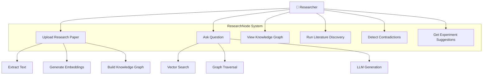
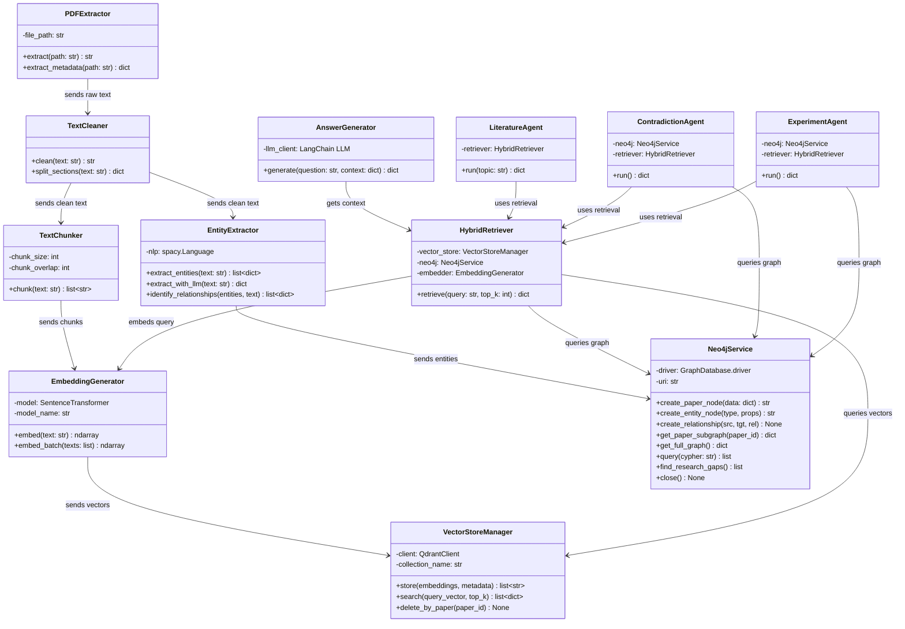
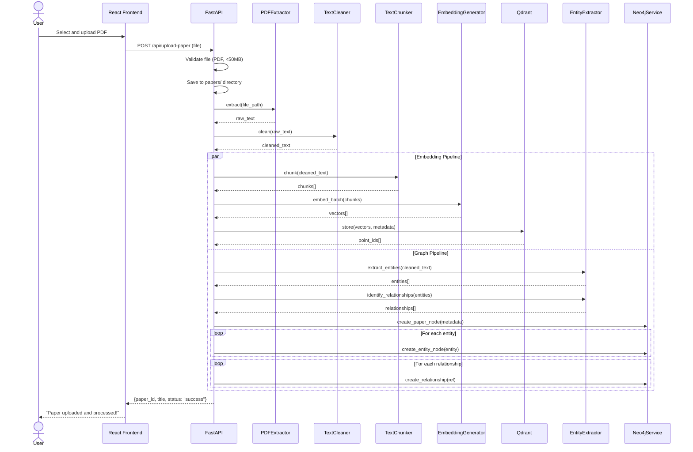
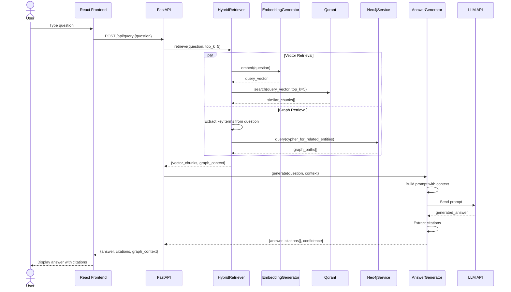
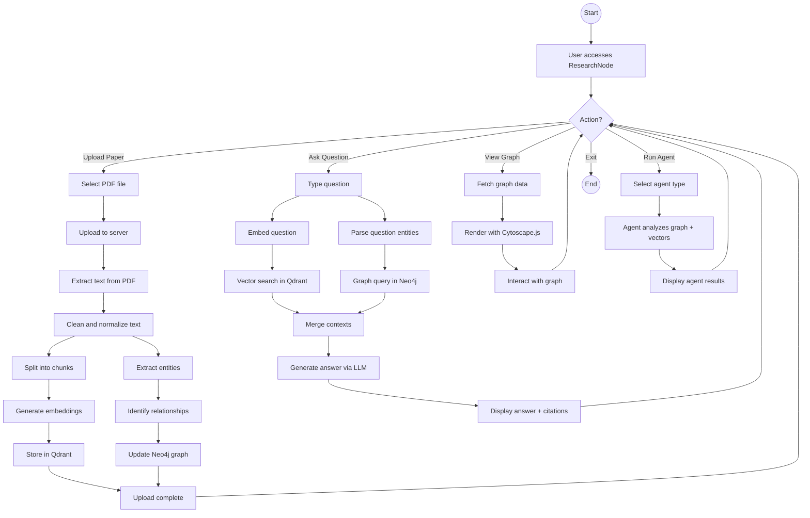
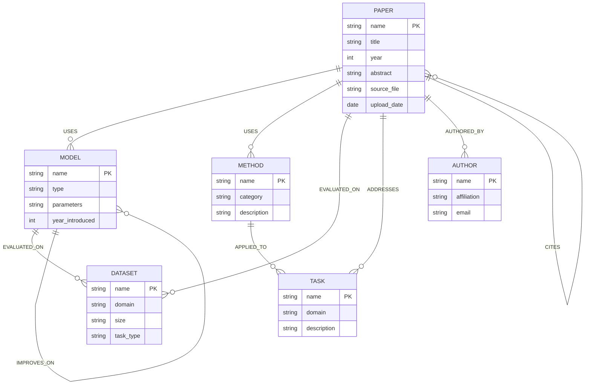
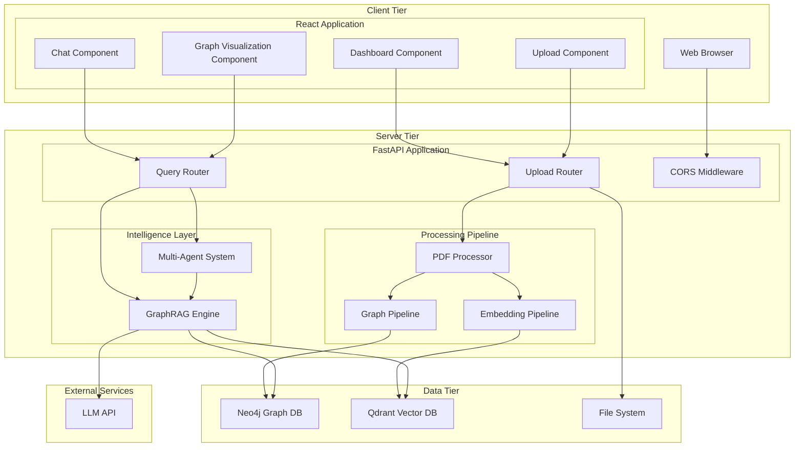
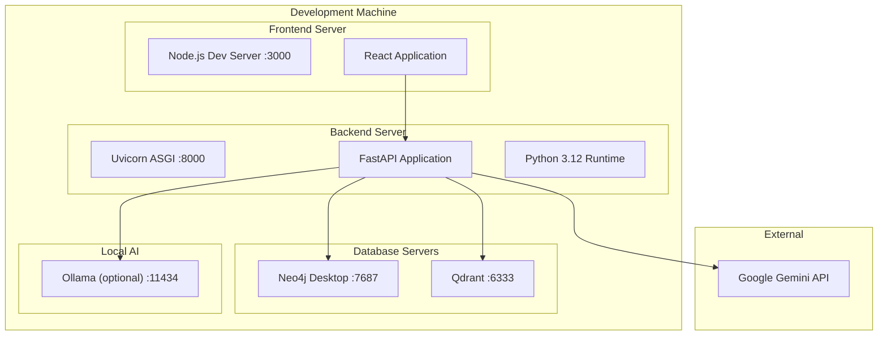

# UML Diagrams

## ResearchNode: A GraphRAG Reasoning Engine for Scientific Literature

**Date:** July 2026

---

## 1. Use Case Diagram

### Use Case Descriptions

| Use Case | Actor | Description | Precondition | Postcondition |
|----------|-------|-------------|-------------|---------------|
| UC1: Upload Paper | Researcher | Upload a PDF paper for processing | User has a PDF file | Paper is processed, graph updated, vectors stored |
| UC2: Ask Question | Researcher | Ask a natural language question about uploaded papers | At least one paper uploaded | Answer with citations returned |
| UC3: View Graph | Researcher | View the knowledge graph visualization | At least one paper processed | Interactive graph displayed |
| UC4: Literature Discovery | Researcher | Find related papers on a topic | At least one paper uploaded | List of related papers with connections |
| UC5: Contradiction Detection | Researcher | Detect conflicting findings across papers | At least two papers uploaded | List of contradictions with evidence |
| UC6: Experiment Suggestions | Researcher | Get AI-suggested experiments | At least two papers uploaded | List of experimental suggestions |

---

## 2. Class Diagram

---

## 3. Sequence Diagram — Paper Upload

---

## 4. Sequence Diagram — Question Answering

---

## 5. Activity Diagram — Complete System Flow

---

## 6. Entity-Relationship Diagram (Neo4j Schema)

---

## 7. Component Diagram

---

## 8. Deployment Diagram

